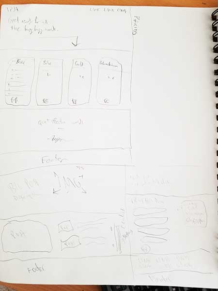

# Video Production Business Alliance

#### _A Site Demo of a company offering professionals in the video production industry a network of talent and resources for building and maintaining an online presence._

#### By Dan Mace

## Description

_VPBA is a business concept that sells online packages that provide freelancers and local video production companies with resources for building their online presence, expanding their markets and improving the way development and customer management happens for the company._

VPBA offers:
 - Networking
 - Automation
 - Development
 - Learning Resources

#### Perspective

VPBA is a network and resource for video production professionals in a constantly revolutionizing online world.

_Who will use this interface? For what purposes?_

Either freelance videographers or persons of influence in video production companies such as business owners, vps and department leaders.
They'll be there to learn more about the offering, more about the company behind the offering and if converted, will want to make contact to negotiate which offerings they are interested in.
Future scaled concepts could include offerings that are effective enough to offer to large, already successful video production companies to boost sales and growth further.

#### Personas

_This is Oswald.  Oswald is a pacific islander who lives in "The Colony", a city in Denton county, Texas, and a suburb of the DFW metroplex.  Oswald is immersed in industry living in the metroplex.  He shields himself from the amorality of big corporations by attending a catholic church in the shape of a large box at the end of one of the thousands of strip malls that swath the land around him.  Before marrying, he worked as a unit manager for a financial firm._

_Somewhere along the twisted path of Bro-dom and exploitative corporate behavior, Oswald found himself reflecting on his life and wondering if the career decisions he was making were making him happy.  He thought back on his childhood, the last time he really felt an unburdened joy, the feelings of creation and wonderment and that itch in the back of his head ever since he first held a camera.  He talked with his girlfriend at the time, and she was like, "YEA! GO FOR IT!", so he put in his two weeks then went out and bought a new lens for his aging Canon Rebel and a stack of 100 business cards._

_"I'm a business now.  A business is like a cartoon character.  It has a hat and some catchphrases, and it's going to make you laugh or reflect on the feelings you feel when it shares a common thread of thought with you.  I shall be... Punchbox! I love it, and because I am walking this path, I am forced to the conviction that others will to!"_

_And so Oswald bought a business license and became Punchbox Media.  But, where to start..._  

_WEDDINGS!~_

_Oswald shot weddings for family and friends of family, but his life still felt lacking.  This wasn't what he was born for.  There was no creatiment or wonderjoy.  How for?  Oh, lost!  I must get into commercial development!  I need to appeal to businesses... people with m0-m0-m0ney.  I need... a website!_

_The year is 2006 and websites suck.  Some websites don't, but most do.  They're also ridiculously expensive.  Oswald has been shooting weddings for 4 years -primarily-, as he says.  7-11 was a side job.  He can't afford much of anything.  But, lo!, come forth a redeemer in the shape of an older nephew who builds webbbsites.  Thank the heavens!  He's an honest man, and the lord descends blessings on his good servants in their time of need._

_The site comes out 6 years later... it's got the info, it's got the pictures, it's got video, the whole checklist kaboodle.  It doesn't look like Nike or anything, but now Punchbox is a company for real.  It's just in time, because in the past 6 years, Oswald has shot just 12 weddings, 3 events and 2 online videos._

_Oswald sees his new channel bring contacts in, but it's slow, and few people respond to his follow up emails.  He nails a couple start ups for some online video, and the next few years rounds him out at a not-quite-survivable 20 projects per year.  It's not enough.  The family feels the stress.  How many years of scraping by will the wife put up with?_

_Enter VPBA!  Business coaching, talent networks and website packages that keep up with modern trends in developing UI/UX and the latest and greatest platforms wahoo!  There's the 6k custom, fix-your-brand package, but there's also some nice cheap web template offers with maintenance and things that fit Oswald's price range.  "Thanks VPBA~!  Now, I can attract more clients and better ones at that!  Cause, now my site isn't just better, but me and my business are, too, which was really probably the greatest problem all along..."_

### FIN

#### User Stories

As a failing business owner, I want a big red button that will allow me to not change anything about myself, my offering or my day-to-day processes and will also increase my monthly revenue by over 50%.

As a fledgling business owner, I want solutions and optimizations that allow me to run and manage my business effectively with the least possible amount of management.

As an established but struggling business owner, I want a solution that will bring my company in line with today's technological standards as my next effort to increase sales.

As a freelance videographer, I want to learn more about how I turn my passion into an effective business model so that I can create some real equity.

#### Competitive Evaluation

https://wooshii.com/ - Dashboard for Video Project Management and network for contracting labor.  Around 13,000 accounts.

Wooshii targets the user's frustration with having too many tools and channels to manage effectively.  They provide a project dashboard for handling all aspects of the development process and they provide a network of various types of talent for needs related to running a video production company.  The idea is that the people you hire on the network will collaborate with you through their dashboard.

Their offering highlights the following benefits:

 - The ability to take on a larger amount of projects (10 times the amount you normally do) through the increase of productivity that the app provides.  

 - The network allows your company to offer services your team doesn't cover in house.  

 - The cloud services allow you to deliver content to clients overnight, anywhere in the world.

 - The platform gives you a strategy that gives you greater control over the development process.

 The other pages give just a little more information than the home page on Product Tour and provides the pricing table on its own page.  The rest of the site is the platform behind a login.

 They've opted to not load the site with content to make the product the feature for the url.  Content and styling are basic, but optimal for performance.  The product will sell itself more than a colorful landing page.

#### Concept

Sketch for Home Page

Sketch for About Page

Sketch for Other Pages

## Setup/Installation Requirements
- To view in Adobe XD, first go to https://github.com/swampcamel/vpba.
- Click the green `Clone or download` button on the right, and select `Download ZIP`.

- To view online, visit: https://xd.adobe.com/view/80ccab0c-2b9e-412a-41cb-6cadb237c25e-f6fd/?fullscreen

## Known Bugs

## Support and contact details
- For questions or support you can email us individually at:
  - Dan Mace: dmacebeta@gmail.com

## Technologies Used
- This program uses HTML, CSS, and SASS, and makes use of the FontAwesome and Google Font libraries.

## Attributions
-
-
-
-

### License

